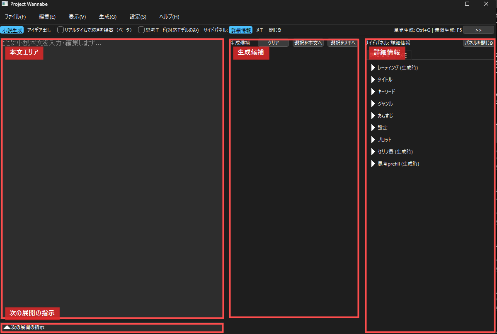

# Project Wannabe

**Project Wannabe** は、小説執筆に特化した AI モデル **「[wanabiシリーズ](https://huggingface.co/collections/kawaimasa/wanabi)」** と、その能力を使いやすくするための専用デスクトップアプリケーションを組み合わせたプロジェクトです。

ローカル環境で KoboldCpp とモデルを起動し、Project Wannabe から操作します。生成された文章をそのまま採用するだけでなく、候補を見比べ、気に入った部分を本文・メモ・詳細情報へ転記しながら、小説を少しずつ組み立てていくためのツールです。

## 🎯 目的とコンセプト

Project Wannabe は、**小説を書く人が AI を「執筆相手」として扱いやすくする**ことを目的にしています。

wanabi シリーズは、小説本文の生成、物語の続きの生成、タイトル・あらすじ・設定・プロットなどのアイデア出しを行いやすいように調整されたモデルです。Project Wannabe は、そのモデルに適した入力欄、生成モード、転記操作を用意し、執筆中の試行錯誤をできるだけ少ない手数で行えるようにします。

このプロジェクトで重視しているのは、AI に一度で完璧な小説を書かせることではありません。

* まずアイデアを出す
* 使えそうな設定や展開を詳細情報に移す
* 本文を書き始める
* 生成候補を何度も出す
* 気に入った候補だけを本文へ挿入する
* 直近の展開を「次の展開の指示」で調整する

このように、**AI ガチャを回しながら、人間が選択して作品を作る**ことを前提にしています。ローカルで動かすため、外部サービスの料金や検閲フィルターを気にせず、手元の環境で自由に試行錯誤できます。

**前提:** Project Wannabe を使用するには、別途 **[KoboldCpp](https://github.com/LostRuins/koboldcpp)** を起動し、**[wanabiシリーズ](https://huggingface.co/collections/kawaimasa/wanabi)** などの GGUF モデルをロードしておく必要があります。



## ✨ 主な機能

### 💡 アイデア出し

タイトル、キーワード、ジャンル、あらすじ、設定、プロットなどを AI に考えさせます。すべての項目を埋める必要はありません。キーワードだけ、ジャンルだけ、あるいは空欄からでも試せます。

アイデア出しモードでは、生成する項目を選べます。

* 全部
* タイトル
* キーワード
* ジャンル
* あらすじ
* 設定
* プロット

生成された `# タイトル:` や `# あらすじ:` などのブロックは、詳細情報パネルの各項目へ転記できます。

### ✍️ 小説生成

詳細情報と本文をもとに、小説本文を生成します。本文が短い場合は冒頭や新しい本文の生成として扱われ、本文が十分にある場合は自然な続きの生成として扱われます。

タイトル、あらすじ、設定、プロットなどは、本文生成時の参考情報として使われます。全部をきっちり書くよりも、まずは重要な情報だけ入れて、生成結果を見ながら育てていく使い方が向いています。

### 🔄 無限生成

`F5` で無限生成を開始すると、停止するまで生成候補を繰り返し作ります。候補は本文へ自動確定されないため、良いものだけを選んで挿入できます。

「一発で決める」よりも、「候補を何本か見て選ぶ」使い方に向いています。

### 📝 生成候補カード

生成結果は中央の **生成候補** エリアにカードとして追加されます。各カードから次の操作ができます。

* **本文へ挿入:** 候補全文、または選択した部分を本文へ挿入します。
* **メモへ送る:** 気になった候補や使うか迷う候補をメモへ送ります。
* **コピー:** 候補をクリップボードへコピーします。
* **削除:** 候補カードを非表示にします。

思考モードを使っている場合、対応する出力では「思考」欄も折りたたみ表示されます。

### 🧭 詳細情報サイドパネル

右側のサイドパネルには、作品の情報をまとめます。

* レーティング
* タイトル
* キーワード
* ジャンル
* あらすじ
* 設定
* プロット
* セリフ量
* 固定思考
* メモ

サイドパネルは閉じることができるため、本文と生成候補を広く使いたいときは非表示にできます。ツールバーの `詳細情報`、`メモ`、`閉じる` から切り替えます。

### 📌 次の展開の指示

本文エリアの下には **次の展開の指示** があります。ここには、作品全体のプロットではなく、次に生成してほしい直近の展開を書きます。

例:

```text
主人公のエルフの少女が、森の中で迷子のドラゴンと出会うシーン。
驚きと少しの警戒心、そして好奇心が入り混じった描写を。
```

単語だけでも使えます。

```text
主人公エルフ
迷子ドラゴン登場
雨上がりの森
```

「次の1000文字くらいで何を起こすか」を書く場所だと考えると扱いやすいです。

### 👻 リアルタイムで続きを提案（ベータ）

本文を編集中に、カーソル位置へ薄い文字で続きの候補を表示します。

| 操作 | 内容 |
| :--- | :--- |
| `Tab` | 提案を確定 |
| `Esc` | 提案をキャンセル |
| `Ctrl + Space` | 手動で提案を生成 |

設定から、自動生成と手動生成を切り替えられます。長い本文で快適に使うには、KoboldCpp 側で十分なコンテキスト長を確保し、VRAM 内に収まる設定にすることをおすすめします。

### 🧠 思考モード（対応モデルのみ）

現時点で Project Wannabe の思考モードが対象にしているのは、Gemma 4 系の思考対応モデルです。生成結果に思考出力が含まれる場合は、本文とは分けて生成候補カード内の「思考」欄に表示します。新モデル **[Wanabi-Gemma4-31B](https://huggingface.co/kawaimasa/Wanabi-Gemma4-31B-GGUF)** に向けた機能です。

| 使うモデル | チャットテンプレモード | Thinking Template | KoboldCpp 側 |
| :--- | :--- | :--- | :--- |
| Wanabi-Gemma4-31B | `汎用` | `Gemma 4（Wannabeモデル用）` | `Use Jinja` を有効 |
| 一般の Gemma 4 系モデル | `汎用` | `Gemma 4（一般用）` | `Use Jinja` を有効。加えて `Chat Template Kwargs` に `{"enable_thinking":true}` を指定 |
| 旧 wanabi シリーズ | `旧wanabiシリーズ` | 思考モード対象外 | 通常どおり |

思考モードは、設定の **チャットテンプレモード** が `汎用` のときに使えます。リアルタイム提案では使用できません。

Wanabi-Gemma4-31B では、KoboldCpp の `Chat Template Kwargs` を通常は手で入れる必要はありません。一般の Gemma 4 系モデルは `Gemma 4（一般用）` で試せますが、KoboldCpp 側で `{"enable_thinking":true}` を渡す必要があります。コマンドラインで起動する場合は、例として `--chat-template-kwargs '{"enable_thinking":true}'` または `--jinja-kwargs '{"enable_thinking":true}'` を指定します。

### 🔍 検索・置換

`Ctrl + F` で検索と置換を開きます。本文、メモ、詳細情報の一部を対象に検索できます。置換は便利ですが、長い作品では念のためプロジェクトを保存してから使うことをおすすめします。

### 🗂️ 保存・読み込み・書き出し

* **プロジェクト保存:** 本文、詳細情報、メモを `.json` として保存します。
* **プロジェクト読み込み:** 保存した `.json` から作業を再開します。
* **本文書き出し:** 本文を `.txt` として書き出します。タイトルを冒頭に含めるか選べます。

## 🖥️ 画面の見方

現在の画面は、大きく3つの領域に分かれています。

### 左: 本文エリア

小説本文を書く場所です。ここに入力されている文章が、生成時の文脈になります。本文エリアの下には **次の展開の指示** があり、直近の展開だけを追加で指示できます。

### 中央: 生成候補

AI の出力がカード形式で並びます。候補を見比べ、使うものだけ本文へ挿入します。無限生成中も候補は自動確定されないため、あとから選べます。

### 右: サイドパネル

詳細情報とメモを表示します。本文を広く使いたい場合は閉じられます。アイデア出しモードでは、ここに生成項目の選択も表示されます。

## 🚀 基本的な使い方

### 1. KoboldCpp を起動する

[KoboldCpp](https://github.com/LostRuins/koboldcpp/releases/latest) を起動し、GGUF モデルをロードします。通常は `http://localhost:5001` で API が待ち受けます。

### 2. Project Wannabe を起動する

Windows では `run_app.bat` を実行します。初回は仮想環境の作成と依存ライブラリのインストールが行われます。

手動で起動する場合:

```bash
python -m venv venv
venv\Scripts\activate
pip install -r requirements.txt
python main.py
```

### 3. チャットテンプレモードを選ぶ

初回起動時に **チャットテンプレモードの選択** が表示されます。

| 選択肢 | 使う場面 |
| :--- | :--- |
| 旧wanabiシリーズ | `kawaimasa/Wanabi-Novelist-24B-GGUF`、`kawaimasa/Wanabi-Novelist-12B-GGUF`、`kawaimasa/wanabi_24b_v1_GGUF`、`kawaimasa/wanabi_mini_12b_GGUF` を使う場合 |
| 汎用 | Wanabi-Gemma4-31B、一般の Gemma 4 系モデル、またはモデル側のチャットテンプレートを使いたい場合 |

`汎用` は、KoboldCpp 側のチャットテンプレートを使うモデル向けのモードです。Wanabi-Gemma4-31B や Gemma 4 系の思考モードを使う場合はこちらを選びます。

この設定はあとから `設定` > `生成パラメータ設定...` > `チャットテンプレモード` で変更できます。

### 4. KoboldCpp を起動・確認する

この手順は、1で手動起動した KoboldCpp の代わりに Project Wannabe から起動したい場合、または起動済み KoboldCpp への API 接続を確認したい場合の補足です。すでに KoboldCpp を起動して接続できている場合は、ポート確認だけ行えば先へ進めます。

Project Wannabe から起動したい場合は、`設定` > `KoboldCpp 起動...` を開き、KoboldCpp の exe と必要に応じて `.kcpps` 設定ファイルを選びます。

* `起動`: `.kcpps` がある場合はその設定で起動します。`.kcpps` がない場合は KoboldCpp のGUIを開きます。
* `設定を変えて起動`: `.kcpps` を読み込んだ状態で KoboldCpp のGUIを開きます。
* `コマンドをコピー`: 実行コマンドをクリップボードへコピーします。

`.kcpps` からポートを読み取れる場合は、Project Wannabe 側の KoboldCpp API ポートにも反映します。起動後は API 接続確認を行い、接続できたかをダイアログ内に表示します。

`.kcpps` がない場合、または `.kcpps` からポートを読み取れない場合は、`KoboldCpp 設定...` の API ポートを使って接続確認します。標準は `5001` です。

`設定` > `KoboldCpp 設定...` を開き、KoboldCpp のポートと一致しているか確認します。標準では `5001` です。

### 5. アイデアを出す

ツールバーで `アイデア出し` を選びます。サイドパネルの `生成項目` で `全部` や `タイトル` などを選び、`Ctrl + G` で生成します。

気に入ったタイトルやあらすじが出たら、出力を選択して詳細情報パネルの `← 転記` を押します。キーワードやジャンルも同じように転記できます。

### 6. 本文を生成する

ツールバーで `小説生成` を選びます。本文エリアに書き出しや既存本文を入れ、必要なら `次の展開の指示` を書いてから `Ctrl + G` を押します。

生成候補カードを確認し、使いたいものを `本文へ挿入` します。気に入らなければ、もう一度生成します。

### 7. 候補をたくさん出して選ぶ

`F5` で無限生成を開始します。候補を十分に出したら、もう一度 `F5` で停止します。候補カードから必要なものだけ本文へ挿入します。

### 8. 保存する

`ファイル` > `名前を付けて保存...` でプロジェクトを保存します。本文だけを外部に出したい場合は、`ファイル` > `出力内容を書き出し...` を使います。

より詳しい手順は [Quick Start Guide](docs/Quick_Start_Guide.md) を参照してください。

## ⚙️ 設定

設定はメニューバーの `設定` と `表示` から変更できます。設定値はプロジェクトルートの `config.json` に保存されます。`config.json` がない場合は起動時に自動生成され、古い `config.json` は不足している項目が自動で補完されます。

`config.json` は利用環境ごとのローカル設定ファイルです。Git 管理には含めません。

### KoboldCpp 起動

`設定` > `KoboldCpp 起動...`

KoboldCpp の exe と `.kcpps` 設定ファイルを選んで起動します。`.kcpps` の内容は Project Wannabe 側では直接編集せず、`設定を変えて起動` で KoboldCpp のGUIを開いて変更します。

### KoboldCpp 設定

`設定` > `KoboldCpp 設定...`

KoboldCpp API のポート番号を指定します。標準は `5001` です。

### 生成パラメータ設定

`設定` > `生成パラメータ設定...`

主な項目は以下です。

| 項目 | 内容 |
| :--- | :--- |
| 最大出力長 | 1回の生成で出す長さ。アイデア出し/小説生成、思考ON/OFFごとに設定できます。 |
| Temperature | 高いほど多様、低いほど安定しやすくなります。 |
| Min P / Top P / Top K | 生成候補の絞り込み方法です。 |
| Repetition Penalty | 同じ表現の繰り返しを抑えます。 |
| デフォルトレーティング | 新規作成時のレーティング初期値です。 |
| チャットテンプレモード | `旧wanabiシリーズ` または `汎用` を選びます。 |
| System Prompt | 汎用モードで使う system prompt です。 |
| Thinking Template | 思考モードのテンプレートを選びます。 |
| 最大コンテキスト超過時の処理 | 本文が長くなったときに、古い本文を圧縮・トリムする方法です。 |
| 出力から本文への転記設定 | 候補を本文へ挿入するときの位置や空行数を指定します。 |

### リアルタイム提案設定

`設定` > `設定: リアルタイム提案（ベータ）...`

| 項目 | 内容 |
| :--- | :--- |
| 最大生成長 | 1回の提案で出す長さ |
| 反応待ち時間 | 入力停止から提案開始までの待ち時間 |
| 改行を生成しない | 提案を短い続きに寄せたい場合に有効 |
| 動作モード | 自動、または `Ctrl + Space` の手動生成 |

### 表示設定

`表示` > `フォント設定...` から、アプリ全体のフォントとサイズを変更できます。

## ⌨️ ショートカットキー

| キー操作 | 機能 | 備考 |
| :--- | :--- | :--- |
| `Ctrl + G` | 単発生成 | 現在のモードで1回生成 |
| `F5` | 無限生成 開始/停止 | 生成中の停止にも使用 |
| `Ctrl + F` | 検索・置換 | 本文や詳細情報を検索 |
| `F3` / `Shift + F3` | 次を検索 / 前を検索 | 検索中に使用 |
| `Tab` | リアルタイム提案を確定 | 提案表示中 |
| `Esc` | リアルタイム提案をキャンセル | 提案表示中 |
| `Ctrl + Space` | 手動で提案を生成 | 手動モード、または任意生成 |

## 📚 関連ドキュメント

* [Quick Start Guide](docs/Quick_Start_Guide.md) - Windows でのセットアップと、アイデア出しから本文生成までの流れ
* [Dynamic Prompts & コンテキスト制御ガイド](docs/Dynamic_Prompts_Guide.md) - `@//`、`@break`、`{A|B}` などの特殊記法
* [プロンプト生成ロジック解説](docs/prompt_logic.md) - Project Wannabe が AI に送るプロンプトの内部仕様

## 更新履歴 (Changelog)

### 2026年5月31日 - 大規模アップデート: 思考モデル対応とUI刷新

* **[Wanabi-Gemma4-31B](https://huggingface.co/kawaimasa/Wanabi-Gemma4-31B-GGUF) リリース予定:**
    * Gemma 4 系の思考対応モデルとしてリリース予定です。
    * Project Wannabe 側では **チャットテンプレモード: `汎用`**、Thinking Template: **`Gemma 4（Wannabeモデル用）`** を選んでください。
    * KoboldCpp 側では **Use Jinja** を有効にしてください。`Chat Template Kwargs` は通常そのままで使います。
    * モデルURLはリリース前のプレースホルダーです。公開後に正式URLへ更新してください。
* **思考モデル対応:**
    * Wanabi-Gemma4-31B などの思考対応 Wannabe モデルを扱うための思考モードを追加しました。
    * 現時点で Project Wannabe が対象にしている思考モードは Gemma 4 系です。
    * 思考モードでは、モデルが出した思考部分と本文出力を分けて扱い、生成候補カード内の「思考」欄に表示します。
    * Wanabi-Gemma4-31B では、Project Wannabe 側で **チャットテンプレモード: `汎用`**、Thinking Template: **`Gemma 4（Wannabeモデル用）`** を選びます。
    * KoboldCpp 側では **Use Jinja** を有効にしてください。Wanabi-Gemma4-31B では、`Chat Template Kwargs` は通常そのままで使います。
    * 一般の Gemma 4 系モデルを試す場合は、**チャットテンプレモード: `汎用`**、Thinking Template: **`Gemma 4（一般用）`** を選びます。KoboldCpp 側では **Use Jinja** に加えて、`Chat Template Kwargs` に `{"enable_thinking":true}` を指定してください。
    * リアルタイム提案では思考モードは使用しません。短い補完候補ではなく、通常の小説生成・アイデア出しで使う機能です。
* **チャットテンプレモードの追加:**
    * `旧wanabiシリーズ` と `汎用` を選べるようになりました。
    * `旧wanabiシリーズ` は、従来の wanabi 向けプロンプト形式を Project Wannabe 側で組み立てるモードです。
    * `汎用` は、KoboldCpp 側のチャットテンプレートを使うモデル向けのモードです。Wanabi-Gemma4-31B や Gemma 4 系の思考モードを使う場合はこちらを選びます。
    * 本文の続きを自然につなぐため、必要に応じて assistant prefill を使います。これは「ここから続けて書いてほしい」という書き出しを assistant 側に置く仕組みです。
* **UI刷新:**
    * 本文、生成候補、サイドパネルを中心にした構成へ整理しました。
    * 詳細情報とメモは右サイドパネルで開閉できます。
    * オーサーズノートは本文下部の「次の展開の指示」として扱いやすくしました。
    * 生成結果はカードとして管理し、本文へ挿入、メモへ送る、コピー、削除がしやすくなりました。
* **ドキュメント更新:**
    * README、Quick Start Guide、Dynamic Prompts Guide、prompt_logic を現行仕様に合わせて更新しました。
    * 一般の Gemma 4 系モデルで思考モードを使う場合に `{"enable_thinking":true}` が必要なことをREADMEへ追記しました。

### 2025-12-28 - 大規模アップデート🎉 新モデル・リアルタイム提案機能・検索機能の実装とコンテキスト管理の強化

* **[Wanabi-Novelist-24B](https://huggingface.co/kawaimasa/Wanabi-Novelist-24B-GGUF):**
    * ベースモデルの強化、コンテキストの増加、データ量と品質の向上を行った wanabi モデルです。
    * 詳細はモデルカードをご確認ください。
* **リアルタイムで続きを提案（ベータ）機能:**
    * 執筆中のカーソル位置に AI が続きの文章を薄い文字で提案します。
    * `Tab` で確定、`Esc` でキャンセル、`Ctrl + Space` で手動生成できます。
* **検索・置換機能（ベータ）:**
    * `Ctrl + F` で検索ダイアログを表示し、本文・メモ・詳細情報を対象に検索・置換できます。
* **本文の動的トークン数圧縮:**
    * KoboldCpp API の `tokencount` と `true_max_context_length` を利用し、プロンプトが最大コンテキスト長を超えないように本文の先頭部分を動的に調整します。
* **コメントアウト・コンテキスト制御:**
    * `@//`、`@/* ... @*/`、`@break`、`@startpoint`、`@endpoint` によって、AI に読ませる範囲を制御できます。
    * 詳細は [Dynamic Prompts & コンテキスト制御ガイド](docs/Dynamic_Prompts_Guide.md) を参照してください。

<details><summary>過去の変更ログをみる</summary>

### 2025-08-28 - wanabi 24b v2をリリース🎉

* **READMEのリンクを更新:**
    * wanabi 24b v2を推奨モデルに変更
* **生成時の安定性向上:**
    * CONTタスク時にEOSトークンをモデルが生成しないように設定。

### 2025-07-18 - 長い小説執筆時の挙動改善

* **本文コンテキストの管理機能の追加:**
    * 非常に長い小説を執筆する際に、プロンプトに含まれる本文が長くなりすぎて重要な指示が失われるのを防ぐ機能を追加しました。
    * 設定画面から最大本文コンテキスト長を指定できるようにしました。

### 2025-05-28 - プロンプト生成ロジック改善

* **継続タスクの安定性向上:**
    * 本文の続きを生成する際の出力品質安定化を図りました。
    * 本文末尾が短い場合や不完全な場合でも、自然な続きが生成されやすいように調整しました。

### 2025-05-24 - wanabi mini 12bをリリース🎉

* **特徴:**
    * Mistral Nemo をベースにしたモデル。
    * 独自のキャリブレーションデータを用いた imatrix 量子化を提供。
    * アイデア出し補間に対応。

### 2025-05-16 - wanabi 24b v0.3をリリース🎉

* **特徴:**
    * v0.1より4倍の学習量。
    * 16GBから24GBクラスのGPUを想定した量子化モデルを提供。

### 2025-05-05 - IDEA機能改善

* **アイデア出し機能強化:**
    * 生成する項目を選択可能にしました。
    * 「高速な手法（実験的）」を追加しました。
    * IDEAタスク処理ロジックを `IdeaProcessor` に分離しました。

### 2025-04-28 - 入力支援機能の強化

* **キーワード/ジャンルのタグ表示改善**
* **スペースを含むタグの入力に対応**
* **Dynamic Prompts の導入**
    * `{選択肢A|選択肢B|"選択肢 C"}` が利用可能になりました。

### 2025-04-26 - オーサーズノート入力 UI を追加

* **オーサーズノート:**
    * 次に起きる展開、行動、心情描写などを記述できるようにしました。
    * 小説全体の構造を書くプロットとは異なり、直近の展開を指定するための項目です。

### 2025-04-26 - レーティング機能追加

* デフォルトレーティングを設定可能にしました。
* 詳細情報にレーティング選択を追加しました。

### 2025-04-25 - 機能追加・改善

* Top-K 設定を追加しました。
* 継続タスクのプロンプト順序選択機能を追加しました。
* 単発生成の途中停止機能を追加しました。
* セリフ量指定 UI を追加しました。

</details>

## 今後の予定

* wanabi シリーズの更新に合わせたプロンプト・UI調整
* 長編執筆時のコンテキスト管理の改善
* リアルタイム提案と検索・置換の安定化
* チュートリアル画像の差し替えと追加

## 免責事項 / Limitations

* **利用上の注意:** 本ソフトウェアおよび wanabi シリーズのモデルは、研究および実験的な目的で提供されています。利用者は、適用される法律および規制を遵守する責任を負います。違法な目的や他者の権利を侵害する目的での使用は固く禁じます。
* **生成内容に関する注意:**
    * **偏り:** 使用しているデータセットの特性上、生成される内容が特定の要素や表現に偏る可能性があります。
    * **不適切な内容:** データセットには多様なテキストが含まれるため、未成年者の閲覧に適さない、または不快感を与える可能性のある文章が生成されることがあります。
    * **品質の限界:** データセットのサイズや性質上、生成される文章の多様性、一貫性、文脈への追従性には限界があります。
* **自己責任:** 本ソフトウェアおよびモデルの使用によって生じたいかなる結果についても、開発者は一切の責任を負いません。全て自己責任においてご利用ください。

## 謝辞 (Acknowledgements)

Project Wannabe の開発にあたり、以下のプロジェクトやツールから多大な影響と助力を受けました。心より感謝申し上げます。

* **EasyNovelAssistant:** アプリケーションのアイデアと設計の参考にさせていただきました。
    * [https://github.com/Zuntan03/EasyNovelAssistant](https://github.com/Zuntan03/EasyNovelAssistant)
* **LLaMA-Factory:** 「wanabi 24B」モデルのファインチューニングを可能にしてくれた素晴らしいフレームワークです。
    * [https://github.com/hiyouga/LLaMA-Factory](https://github.com/hiyouga/LLaMA-Factory)
* **Gemini 2.5 Pro:** アプリケーション開発における様々な課題解決やコード生成において、強力なサポートを提供してくれました。
