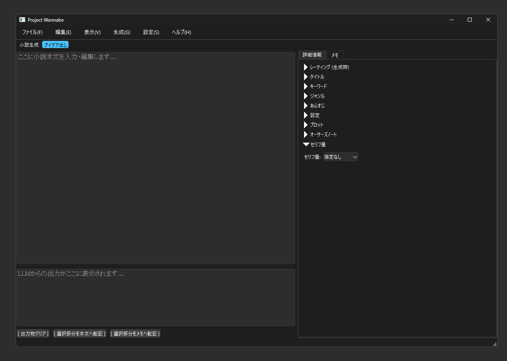

# Project Wannabe

**Project Wannabe** は、小説執筆に特化した AI モデル **「[wanabiシリーズ](https://huggingface.co/collections/kawaimasa/wanabi-683144d1bf44a0b922aa1609)」** と、その能力を最大限に引き出すための専用デスクトップアプリケーション（フロントエンド）を統合したプロジェクトです。

[wanabiシリーズ](https://huggingface.co/collections/kawaimasa/wanabi-683144d1bf44a0b922aa1609)には現時点では2つのモデルがあります。VRAMと必要なコンテキスト長に応じて許す限り大きなモデルと量子化レベルを選択ください。

## 🎯 目的とコンセプト

このアプリケーションは、Mistral Small 3 Base (24B) をベースに、小説データを中心としたデータセット等を用いて独自にファインチューニングされた **「[wanabi](https://huggingface.co/collections/kawaimasa/wanabi-683144d1bf44a0b922aa1609)」モデル** の持つ、**小説生成に関する特有の能力**を最大限に引き出すことを目的としています。

「[wanabiシリーズ](https://huggingface.co/collections/kawaimasa/wanabi-683144d1bf44a0b922aa1609)」は、特定の指示形式を用いることで小説のアイデア出し、設定に基づいた本文生成、そして文脈に沿った続きの生成に特化させたファインチューニングモデルです。Project Wannabe は、このモデルとの最適なGUIを提供することで、ユーザーの執筆プロセスを強力にサポートします。

主な機能は以下の通りです。

*   **💡 「wanabi」特化のアイデア生成:**
    タイトル、キーワード、ジャンル、あらすじ、設定、プロットといった小説の構成要素を、「wanabi」が得意とする形式で指示し、アイデアを生成させます。一部の情報から他の要素を補完させることも可能です。
*   **✍️ 高度な本文生成:**
    詳細な設定やプロットを「wanabi」が理解しやすい形で渡し、モデルの能力を活かした整合性の高い小説本文を生成させます。
*   **🔄 最適化された継続執筆支援 (Generate Forever):**
    「wanabi」による自然な続きの生成を、専用インターフェースで効率的に行います。ユーザーは繰り返し生成されるテキストの中から当たりな文章をピックアップし、小説を**「選択」**で作り上げます。

この **Project Wannabe** アプリケーションは、「[wanabiシリーズ](https://huggingface.co/collections/kawaimasa/wanabi-683144d1bf44a0b922aa1609)」モデルの**連続生成能力（無限生成）**を最大限に活用する専用フロントエンドとして機能します。ローカル環境で動作するため、**コストや外部サービスの検閲フィルターを気にすることなく**、自由な試行錯誤（AI ガチャ）が可能です。ユーザーが生成されたテキストの中から最適なものを**「選択」**していくことで、誰でも容易に小説を創り上げられるように支援し、文章創作の敷居を下げることを目指します。

**前提:** このアプリケーションを使用するには、別途 **[KoboldCpp](https://github.com/LostRuins/koboldcpp)** をローカル環境で起動し、**「[wanabiシリーズ](https://huggingface.co/collections/kawaimasa/wanabi-683144d1bf44a0b922aa1609)」モデル**（または互換性のある GGUF 形式のモデル）をロードしておく必要があります。




画像内の一部機能は次期モデルから使用できます。現時点ではmainブランチでは使えませんのでご了承ください。

## ✨ 新機能 

`wanabi`シリーズのモデルは、以下の主要なタスクを実行できます。Preview版から機能が追加・改善されています。

1.  **オーサーズノート機能 (新):**
    *   **目的:** 次に起きる展開、行動、心情描写など、今後おおよそ1000文字以内に起こるような直近の内容を記述することで、続きの文章生成をより細かく誘導します。小説全体の構造を示すプロットとは異なります。
    *   **適用:** 続き生成 (CONT) タスクのプロンプトに組み込まれます。本文が含まれていない場合オーサーズノートは機能しません。その場合plot欄に序盤の展開を書くことで代用可能です。

2.  **レーティング機能 (新):**
    *   **目的:** 生成内容のレーティング（`general` または `r18`）を指定します。

3.  **セリフ量指定機能 (新):**
    *   **目的:** 生成される文章中のセリフの割合を「指定なし」「少ない」「やや少ない」「普通」「やや多い」「多い」から選択します。（現在のv0.1ではまだ完全に反映されませんが、「少ない」を選択することでSS形式のような望ましくない小説形式を防ぐことができます。）

## 🚀 主な機能 (Features)

*   **KoboldCpp 連携:** ローカルで起動中の KoboldCpp APIと連携し、LLM によるテキスト生成を行います。接続ポートは設定可能です。
*   **モード切替:**
    *   **小説生成モード:** 入力された本文や詳細情報に基づいて、小説の続きや冒頭を生成します。
    *   **アイデア出しモード:** 入力された詳細情報に基づいて、タイトル、キーワード、ジャンル、あらすじ、設定、プロットなどのアイデアを生成します。（本文は参照されません。）
*   **詳細情報管理:** 小説の構成要素（タイトル、キーワード、ジャンル、あらすじ、設定、プロット）を専用のUIで管理し、プロンプト生成に利用します。**全てを埋める必要はありません。** 全てをAIに委ねることも可能です。各セクションは折りたたみ可能です。
*   **テキスト生成:**
    *   **単発生成 (Ctrl+G):** 現在の入力に基づいて一度だけテキストを生成します。
    *   **無限生成 (Generate Forever / F5):** 停止するまで継続的にテキストを生成し続けます。生成回数やコストに縛られず、納得のいく表現が見つかるまで試行錯誤を重ねましょう。
*   **テキスト編集:** メインの本文編集エリア、LLM出力表示エリア、メモエリアの3つのテキストエリアを提供します。標準的な編集操作（元に戻す、やり直し、コピー、ペーストなど）が可能です。
*   **ファイル入出力:**
    *   **プロジェクト保存/読込:** 現在の本文、詳細情報、メモの内容を `.json` 形式のプロジェクトファイルとして保存・読み込みできます。
    *   **出力書き出し:** メインの本文エリアの内容を `.txt` ファイルとして書き出すことができます。書き出し時にタイトルを含めるか選択可能です。
*   **テキスト転記:**
    *   **出力 → 本文:** LLM出力エリアで選択したテキストを、本文エリアのカーソル位置に転記します。
    *   **出力 → メモ:** LLM出力エリアで選択したテキストを、メモエリアに追記します。
    *   **出力 → 詳細情報:** アイデア出しモードで生成された、特定の形式（`# 日本語名:\n値`）を持つテキストを選択し、対応する詳細情報欄（タイトル、キーワード、ジャンル、あらすじ、設定、プロット）に転記します。
        *   **例:** 出力エリアで以下のようなテキストブロックを選択し、
          ```
          # タイトル:
          異世界転生したら野良犬だった件

          # キーワード:
          異世界転生
          犬
          追放
          恋愛
          NTR

          # あらすじ:
          通り魔に刺されて死んだと思ったら、異世界で野良犬に転生していた。
          ```
        *   詳細情報タブの「タイトル」欄の横にある `← 転記` ボタンを押すと、「異世界転生したら野良犬だった件」がタイトル欄に転記されます。「キーワード」や「あらすじ」も同様に転記できます。
*   **表示設定:**
    *   **テーマ:** ライトテーマとダークテーマを切り替え可能です。
    *   **フォント:** アプリケーション全体で使用するフォントの種類とサイズを設定可能です。
*   **メモ機能:** 執筆中のアイデアや参照情報などを自由に書き留めておけるメモエリアを提供します。

※各項目の説明と使い方は[クイックスタートガイド](./docs/Quick_Start_Guide.md)に記載しています。合わせてご確認ください。


## 変更履歴 (Changelog)

### 2025-07-18 - 長い小説執筆時の挙動改善
*   **本文コンテストの管理機能の追加:**
    *   非常に長い小説を執筆する際に、プロンプトに含まれる本文が長くなりすぎて重要な指示（参考情報など）が失われるのを防ぐ機能を追加しました。
    *   設定画面から「最大本文コンテキスト長」を指定することで、プロンプトに含める本文の長さを制限できます。
    *   詳細は文書 `docs/prompt_logic.md` を参照してください。

### 2025-05-28 - プロンプト生成ロジック改善
*   **継続タスクの安定性向上:**
    *   AIへの指示形式（プロンプト）に調整を加え、本文の続きを生成する際の出力品質安定化を図りました。
    *   特に、ユーザーが入力した本文の末尾が短い場合や不完全な場合でも、より自然な続きが生成されやすくなるよう改善しました。
    *   詳細は文書 `docs/prompt_logic.md` を参照してください。

### 2025-05-24  [wanabi mini 12b](https://huggingface.co/kawaimasa/wanabi_mini_12b_GGUF)をリリース🎉
*   **特徴**
    *   mistral nemoをベースにした新しいモデル。
    *   独自のキャリブレーションデータを用いたimatrix量子化を行った4つのモデル（IQ4_XS, Q4_K_M, Q5_K_M, Q6_K, Q8_0）を提供。これらは最低VRAM8GBのコンシューマGPUにぴったりと適合します。
    * 　本モデルからアイデア出し補間機能を追加しました。

```
「詳細情報」タブで、タイトル、キーワード、ジャンル、あらすじ、設定、プロットの全てが入力されている状態でアイデア生成を実行すると、モデルはこれらの豊富な情報を活用し、より詳細で具体的なアイデア（例えば、キャラクターの掘り下げ、サブプロットの提案、世界観の補足説明など）を生成しようと試みます。この機能は特別なプロンプト変更を必要とせず、入力情報の量と質に応じて自動的に働きが変化します。
```


### 2025-05-16  wanabi 24b v0.3をリリース🎉
*   **特徴**
    *   v0.1より4倍の学習量
    *   独自のキャリブレーションデータを用いたimatrix量子化を行った4つのモデル（IQ4_XS, Q4_K_M, Q5_K_M, Q6_K）を提供。これらはVRAM16GBからVRAM24GBのコンシューマGPUにぴったりと適合します。

### 2025-05-05 - IDEA機能改善
*   **アイデア出し機能強化:**
    *   生成する項目（タイトル、プロット、全体など）を選択可能に。
    *   「高速な手法（実験的）」チェックボックスを追加。チェックしない場合は、安定性を重視した手法で生成されます。（※「全体」生成時および将来の「補間タスク」では利用不可）
    *   **ストリーミング表示に関する注意:** 「高速な手法」にチェックを入れず、かつ特定の項目（例: 「タイトルのみ」）を選択した場合、出力欄へのストリーミング表示が無効になります。これは後処理のためであり、内部では正常に生成されています。それ以外の場合はストリーミング表示されます。
    *   IDEAタスク処理ロジックを `IdeaProcessor` モジュールに分離。

### 2025-05-03  wanabi 24b v0.1をリリース🎉
*   **READMEのリンクを更新:**
    *   wanabi 24b v0.1を推奨モデルに変更
*   **devブランチをmainブランチに統合:**
    *   mainブランチで新機能（オーサーズノート、レーティング、セリフ量）が使えるように    
    *   従来のpreview版を使いたい人や汎用的なモデルを使いたい人はlegacyブランチをご利用ください。

### 2025-04-28 入力支援機能の強化

*   **キーワード/ジャンルのタグ表示改善:**
    *   詳細情報タブのキーワード欄とジャンル欄で、より多くのタグが一度に表示されるようになり、見やすさが向上しました。
*   **スペースを含むタグの入力に対応:**
    *   キーワードやジャンルに `"ファンタジー RPG"` のようにダブルクォーテーションで囲んで入力することで、スペースを含むフレーズを一つのタグとして登録できるようになりました。（プロンプト生成時にはダブルクォーテーションは除去されます）
*   **Dynamic Prompts (基本) の導入:**
    *   詳細情報タブ及び本文の**すべてのテキスト入力欄**（タイトル、キーワード、ジャンル、あらすじ、設定、プロット、オーサーズノート、本文）で、Dynamic Promptsの簡易記法 `{選択肢A|選択肢B|"選択肢 C"}` が利用可能になりました。現在はそれ以外のフォーマットをサポート**しません**。
    *   プロンプト生成時に、`{}` 内の選択肢からランダムに一つが選ばれて使用されます。
    *   これにより、簡単な操作でプロンプトにランダムなバリエーションを持たせることができます。
    *   例: タイトルに `{冒険者|魔法使い}の{朝|昼|夜}` と入力すると、「冒険者の朝」「魔法使いの夜」などがランダムに生成されます。キーワードやジャンルタグの中でも `{火属性|水属性}` のように使用可能です。
*   **Quick_Start_Guide.mdに画像付きの説明を追加**
    *   各タブの詳細な説明を含む、画像付きチュートリアルを充実させました。

### 2025-04-26 機能追加・改善 (次期モデル準備)

*   **背景:** 新しい学習データセット形式（オーサーズノート対応、Instruction/Input構造変更）で再学習する次期モデルへの対応準備を行いました。

*   **オーサーズノート入力 UI を追加:**
    *   詳細情報タブに「オーサーズノート」入力欄を追加。
    *   オーサーズノート：次に起きる展開、行動、心情描写などを記述するとそれに合わせて続きの文章が生成されます。小説全体の構造を書くプロットと異なり、今後1000文字以内に起きる直近の内容を記述します。
*   **プロンプト生成ロジックを大幅改修:**
    *   継続タスクの Instruction をより具体的に変更。
    *   継続タスクの Input 構造を「(参考情報/本文主要部)」→「オーサーズノート(あれば)」→「本文末尾3行」の形式に変更。順序設定も反映。小説継続タスクにおける安定性と制御性の大幅な向上を期待しています。。
*   **注意:** オーサーズノート機能および新しいプロンプト形式は、**この新しい形式で学習された次期モデル以降で有効**になります。既存のモデル (`wanabi_24b_preview` など) では意図通りに動作しない、または効果がありません。


### 2025-04-26 レーティング機能追加

*   **設定:** デフォルトレーティング (General/R-18) を生成パラメータ設定ダイアログで設定可能に。
*   **UI:** 詳細情報タブにレーティング選択ドロップダウンを追加 (タイトル上に配置)。
*   **プロンプト:** 詳細情報タブで選択されたレーティングを優先し、指示テキスト末尾に ` レーティング: {選択値}` を追加するように変更。
*   **注意:** 次期モデル(wanabi_24b_v1)以降で対応します。wanabi_24b_previewでは明確に非対応です。

### 2025-04-25 - 機能追加・改善

*   **生成パラメータに Top-K 設定を追加:**
    *   設定ダイアログから Top-K (0-200) を指定できるようになりました (0は無効)。
    *   設定値は KoboldCpp API リクエストに反映されます (0の場合はパラメータ除外)。
*   **継続 (CONT) タスクのプロンプト順序選択機能を追加:**
    *   設定ダイアログから、継続生成時のプロンプトにおける「本文」と「参考情報」の表示順序を選択できるようになりました。
        *   `本文との整合性を優先 (推奨)` (参考情報 → 本文)
        *   `詳細情報との整合性を優先` (本文 → 参考情報)
    *   選択された順序がプロンプト生成に反映されます (デフォルトは「本文との整合性を優先」)。本文がコンテキスト長より長い場合は`詳細情報との整合性を優先`を推奨します。
*   **単発生成の途中停止機能を追加:**
    *   実行中の単発生成 (Ctrl+G またはメニュー) を、再度同じ操作 (Ctrl+G, メニュー) または F5 キーを押すことでキャンセルできるようになりました。
    *   キャンセルされると、ステータスバーと出力エリアにメッセージが表示されます。

### 2025-04-25 - 機能追加

*   **背景:** 今後のモデル更新 (wanabi vX など) で、プロンプトによる本文内でのセリフ量の割合の制御に対応する予定です。これに先立ち、UIからセリフ量を指定できる機能を追加しました。
*   **詳細情報タブに「セリフ量」指定UIを追加:**
    *   詳細情報タブに「セリフ量」ドロップダウンを追加しました。
    *   「指定なし」「少ない」「やや少ない」「普通」「やや多い」「多い」から選択できます。
    *   デフォルトは「指定なし」です。
*   **プロンプト生成への反映:**
    *   「指定なし」以外が選択された場合、GENタスクおよびCONTタスクのプロンプト (参考情報ブロック内) に `# セリフ量:` が含まれるようになります。
    *   これにより、将来のモデルでセリフ量に基づいた生成が可能になることを目指します。
    *   アイデア出しタスクには反映/生成されません。

## 使い方 (Usage)

1.  **前提:** KoboldCpp を起動し、「wanabi 24B」モデル（GGUF形式）をロードしておきます。
2.  **起動:** ターミナルで `python main.py` を実行してアプリケーションを起動します。
3.  **初期設定 (初回):**
    *   メニューバーの `設定` > `KoboldCpp 設定...` を開き、KoboldCpp がリッスンしているポート番号（デフォルト: 5001）を確認・設定します。
    *   メニューバーの `設定` > `生成パラメータ設定...` を開き、Max Length, Temperature などの生成パラメータやストップシーケンスを必要に応じて調整します。
4.  **モード選択:** ツールバーの「小説生成」または「アイデア出し」ボタンでモードを切り替えます。
    *   **アイデア出しモード選択時:**
        *   **生成項目:** アイデア出しモードを選択すると、生成したい項目（例: 「タイトルのみ」「プロットのみ」）を選択するドロップダウンが表示されます。目的に応じて選択してください。（「全体」を選択した場合は、後述の「高速な手法」は利用できません。）
        *   **高速な手法（実験的）:** 生成項目の隣に「高速な手法（実験的）」チェックボックスが表示されます。チェックを入れると、より迅速な応答を目指した実験的な手法で生成されます。**ただし、この手法は「全体」生成時には利用できず、将来実装予定の「補間タスク」とも互換性がありません。** チェックしない場合は、安定性を重視した手法が用いられます。通常はチェックしないことをお勧めします。
        *   **【ストリーミング表示に関する注意】** 「高速な手法」にチェックを入れず、かつ特定の項目（例: 「タイトルのみ」）を選択した場合、出力欄へのストリーミング表示が無効になります。これは後処理のためであり、内部では正常に生成されています。それ以外の場合（「高速な手法」にチェックを入れた場合（※全体生成時を除く）、またはチェックを入れずに「全体」を選択した場合）は、ストリーミング表示されます。
5.  **詳細情報入力:** 右側の「詳細情報」タブで、タイトル、キーワード、あらすじ、設定、プロットなどを入力します。これらの情報はプロンプト生成に利用されます。
6.  **本文入力 (小説生成モード):** 左上の本文エリアに、生成のベースとなる小説本文を入力または編集します。
7.  **生成開始:**
    *   **単発生成:** メニューバーの `生成` > `単発生成 (Ctrl+G)` を選択するか、ショートカットキーを押します。
    *   **無限生成:** メニューバーの `生成` > `無限生成 開始/停止 (F5)` を選択するか、ショートカットキーを押します。生成が開始され、左下の出力エリアに結果がストリーミング表示されます。
8.  **生成停止 (無限生成中):** 再度 `F5` キーを押すか、メニューの `無限生成 開始/停止` を選択します。
9.  **テキスト転記:**
    *   出力エリアで生成されたテキストを選択し、`[ 選択部分を本文へ転記 ]` ボタンで本文エリアに挿入します。
    *   出力エリアで生成されたテキストを選択し、`[ 選択部分をメモへ転記 ]` ボタンでメモエリアに追記します。
    *   アイデア出しモードで生成された `# タイトル:` などのテキストを選択し、詳細情報タブの各項目の横にある `← 転記` ボタンで対応する欄に転記します。
10. **プロジェクト保存:** メニューバーの `ファイル` > `名前を付けて保存...` を選択し、現在の作業内容（本文、詳細情報、メモ）を `.json` ファイルに保存します。
11. **プロジェクト読込:** メニューバーの `ファイル` > `開く...` を選択し、以前保存した `.json` ファイルを読み込みます。
12. **出力書出:** メニューバーの `ファイル` > `出力内容を書き出し...` を選択し、現在の**本文エリアの内容**を `.txt` ファイルとして保存します。

より詳細な手順については、[Quick Start Guide](docs/Quick_Start_Guide.md) を参照してください。

## 設定 (Configuration)

アプリケーションの設定は、メニューバーの `設定` および `表示` から変更でき、プロジェクトルートにある `config.json` ファイルに保存されます。

*   **KoboldCpp Port:** (`設定` > `KoboldCpp 設定...`)
    *   KoboldCpp API が動作しているポート番号。
    *   デフォルト: `5001`
*   **生成パラメータ:** (`設定` > `生成パラメータ設定...`)
    *   `Max Length`: 生成するテキストの最大長。
    *   `Temperature`: 生成のランダム性。値が高いほど多様な出力になります。
    *   `Min P`: Min-P サンプリングの値。
    *   `Top P`: Top-P (Nucleus) サンプリングの値。
    *   `Repetition Penalty`: 繰り返しペナルティ。
    *   `ストップシーケンス`: 生成を停止する文字列のリスト（1行に1つ）。
*   **表示設定:**
    *   **テーマ:** (`表示` > `テーマ切り替え`) アプリケーションの見た目（ライト/ダーク）。デフォルト: `light`
    *   **フォント:** (`表示` > `フォント設定...`) アプリケーション全体で使用するフォントファミリーとサイズ。デフォルト: システムのデフォルトフォント
*   **設定ファイル:** `config.json` (プロジェクトルートディレクトリ)
    *   上記の設定値がこのファイルにJSON形式で保存されます。直接編集することも可能ですが、アプリケーションからの変更が推奨されます。

## インストールと実行 (Installation & Running)

### 前提条件

*   **Python:** 3.9 以上
*   **Git:** ソースコードから実行する場合に必要です。
*   **KoboldCpp:** ローカル環境で別途起動し、**「[wanabi 24B](https://huggingface.co/kawaimasa/wanabi_24b_preview_gguf)」モデル (GGUF形式)** または互換性のあるモデルをロードしている必要があります。 ([KoboldCpp](https://github.com/LostRuins/koboldcpp))

### インストール手順

1.  **リポジトリのクローン:**
    ```bash
    git clone https://github.com/kawaii-justice/Project-Wannabe.git
    ```
2.  **ディレクトリ移動:**
    ```bash
    cd Project-Wannabe
    ```
3.  **仮想環境の作成と有効化:**
    *   Windows (cmd.exe):
        ```bash
        python -m venv venv
        venv\Scripts\activate
        ```
4.  **依存ライブラリのインストール:**
    ```bash
    pip install -r requirements.txt
    ```
    (`requirements.txt` には `PySide6`, `qasync`, `httpx` が含まれています。)

KoboldCpp のセットアップを含む、より詳細な手順については [Quick Start Guide](docs/Quick_Start_Guide.md) を参照してください。

### 実行方法

1.  仮想環境が有効化されていることを確認します。
2.  プロジェクトのルートディレクトリ (`Project-Wannabe`) で以下のコマンドを実行します。
    ```bash
    python main.py
    ```

## 今後の予定

*   **継続的な学習:** 現在も拡張データセットを用いた学習を継続しており、チェックポイントごとに順次バージョンアップを公開予定です。
*   **小規模モデルの検討:** より軽量で利用しやすい小規模なモデル（12Bクラスなど）での学習も検討しています。

*(注意: 上記ロードマップは現時点での予定であり、変更される可能性があります。)*

## 免責事項 / Limitations

*   **利用上の注意:** 本ソフトウェアおよび「wanabi 24B」モデルは、研究および実験的な目的で提供されています。利用者は、適用される法律および規制を遵守する責任を負います。違法な目的や他者の権利を侵害する目的での使用は固く禁じます。
*   **生成内容に関する注意:**
    *   **偏り:** 使用しているデータセットの特性上、生成される内容が特定の要素や表現に偏る可能性があります。
    *   **不適切な内容:** データセットには多様なテキストが含まれるため、未成年者の閲覧に適さない、または不快感を与える可能性のある文章が生成されることがあります。
    *   **品質の限界:** データセットのサイズや性質上、生成される文章の多様性、一貫性、文脈への追従性には限界があります。
*   **自己責任:** 本ソフトウェアおよびモデルの使用によって生じたいかなる結果についても、開発者は一切の責任を負いません。全て自己責任においてご利用ください。

## 謝辞 (Acknowledgements)

Project Wannabe の開発にあたり、以下のプロジェクトやツールから多大な影響と助力を受けました。心より感謝申し上げます。

*   **EasyNovelAssistant:** アプリケーションのアイデアと設計の参考にさせていただきました。
    *   [https://github.com/Zuntan03/EasyNovelAssistant](https://github.com/Zuntan03/EasyNovelAssistant)
*   **LLaMA-Factory:** 「wanabi 24B」モデルのファインチューニングを可能にしてくれた素晴らしいフレームワークです。
    *   [https://github.com/hiyouga/LLaMA-Factory](https://github.com/hiyouga/LLaMA-Factory)
*   **Gemini 2.5 Pro:** アプリケーション開発における様々な課題解決やコード生成において、強力なサポートを提供してくれました。
