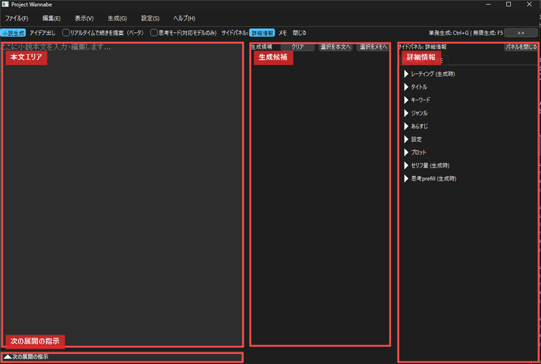
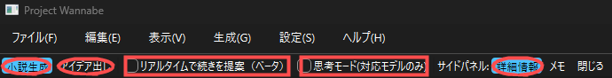
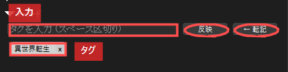
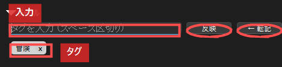
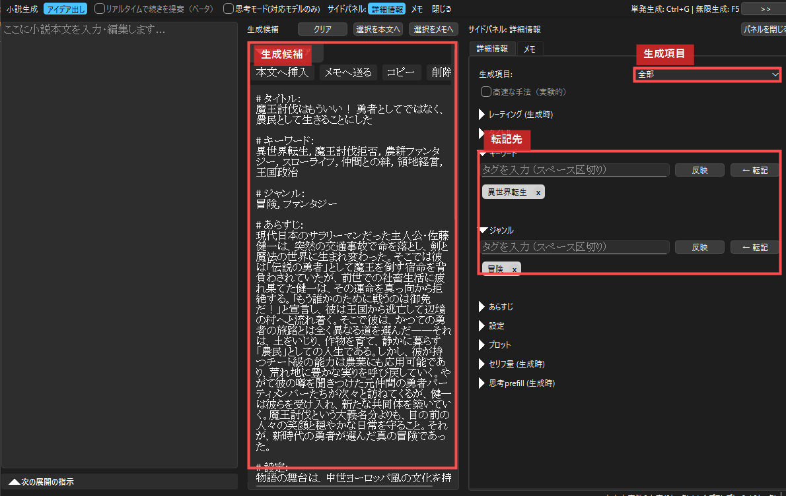
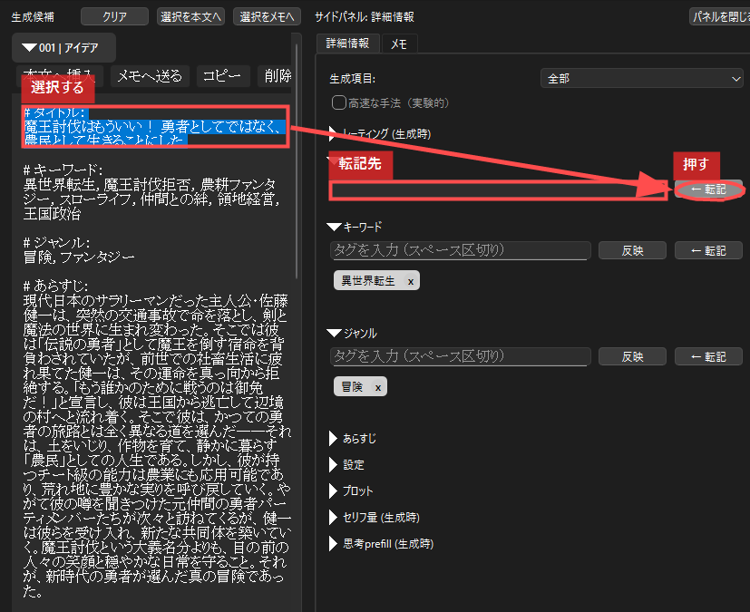
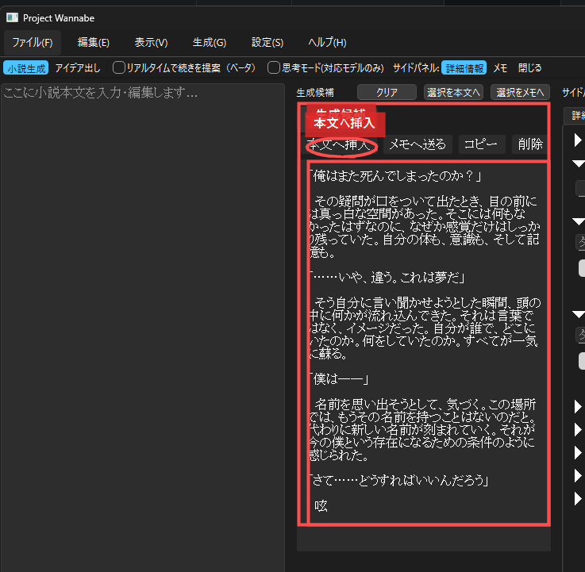

# Project Wannabe & KoboldCpp クイックスタートガイド (Windows 向け)

## 1. はじめに

このガイドでは、Windows 環境で **Project Wannabe** と **KoboldCpp** を準備し、アイデア出しから本文生成、保存までを一通り行う流れを説明します。

Project Wannabe は、KoboldCpp で起動したローカル AI モデルに接続して使います。アプリ単体では生成できないため、先に KoboldCpp と GGUF モデルを準備してください。

大まかな流れは次の通りです。

1. KoboldCpp をダウンロードする
2. wanabi シリーズなどの GGUF モデルをダウンロードする
3. KoboldCpp でモデルを起動する
4. Project Wannabe を起動する
5. アイデア出しで作品情報を作る
6. 小説生成で本文を書き進める
7. プロジェクトを保存する

## 2. 前提条件

### 必要なもの

* **Windows PC**
* **Python 3.9 以上**
* **Git**
* **KoboldCpp**
* **GGUF 形式のモデル**

Python は [Python 公式サイト](https://www.python.org/) からインストールできます。インストール時に **Add Python to PATH** にチェックを入れてください。

Git は [Git for Windows](https://gitforwindows.org/) からインストールできます。

## 3. KoboldCpp のセットアップ

### 3.1 KoboldCpp をダウンロードする

1. [KoboldCpp GitHub Releases](https://github.com/LostRuins/koboldcpp/releases/latest) を開きます。
2. `Assets` から Windows 用の実行ファイルをダウンロードします。
3. `C:\KoboldCpp` など、分かりやすく、できればスペースを含まない場所に置きます。

### 3.2 モデルをダウンロードする

Project Wannabe では、wanabi シリーズの利用を想定しています。

* [wanabi シリーズ](https://huggingface.co/collections/kawaimasa/wanabi)

コレクションから、PC の VRAM に合う GGUF モデルを選びます。迷った場合は、まず小さめの量子化モデルで起動確認し、余裕があれば大きいモデルや高い量子化へ上げていくのが安全です。

<details><summary>モデル選択の目安</summary>

以下はあくまで目安です。KoboldCpp のバージョン、ドライバ、コンテキスト長、KV cache の設定によって必要 VRAM は変わります。

### VRAM 24GB 以上

24B クラスのモデルを比較的扱いやすい環境です。

* 24B の Q4_K_M / Q5_K_M / Q6_K などを検討できます。
* 長いコンテキストを取りたい場合は、量子化や KV cache を軽くする必要があります。
* まずはコンテキスト長 16K から試し、余裕があれば 32K へ上げると調整しやすいです。

### VRAM 16GB

24B の軽めの量子化、または 12B クラスが候補です。

* 品質を優先するなら 24B の軽量量子化を試します。
* 長い文脈や安定性を優先するなら 12B クラスが扱いやすいです。
* KV cache は 8bit を基本に、メモリが厳しい場合だけ軽い設定を試します。

### VRAM 12GB

12B クラスのモデルが主な候補です。

* Q4_K_M や IQ4_XS など、軽めの量子化から試します。
* コンテキスト長は無理に最大へせず、まず 8K から 16K 程度で確認します。

### VRAM 8GB 以下

動作は環境次第ですが、快適さよりも「起動できるか」の調整が中心になります。

* 12B の軽量量子化を試します。
* コンテキスト長を低めにします。
* すべてのレイヤーを GPU に載せず、一部 CPU 側で動かす方法もありますが、速度は大きく落ちます。

</details>

### 3.3 KoboldCpp でモデルを起動する

1. `koboldcpp.exe` を実行します。
2. `Browse` からダウンロードした `.gguf` モデルを選びます。
3. NVIDIA GPU の場合は、CuBLAS または CUDA 系の項目を有効にします。
4. AMD / Intel GPU の場合は Vulkan を試します。
5. `Context Size` を設定します。最初は 8192 や 16384 など、無理のない値から始めます。
6. `KV cache` は、まず 8bit を試します。
7. `Launch` を押します。

起動に成功すると、コンソールに次のような表示が出ます。

```text
KoboldAI API server listening at: http://localhost:5001
```

このウィンドウは、Project Wannabe を使っている間は閉じないでください。

## 4. Project Wannabe のセットアップ

### 4.1 ソースコードを取得する

コマンドプロンプトまたは PowerShell を開き、Project Wannabe を置きたい場所で次を実行します。

```bash
git clone https://github.com/kawaii-justice/Project-Wannabe.git
cd Project-Wannabe
```

### 4.2 かんたん起動

Windows では、まず `run_app.bat` を実行してください。

`venv` がない場合は、仮想環境の作成と必要ライブラリのインストールを行ってからアプリを起動します。

### 4.3 手動で起動する場合

うまく起動しない場合や、手動で確認したい場合は次の手順で起動します。

```bash
python -m venv venv
venv\Scripts\activate
pip install -r requirements.txt
python main.py
```

## 5. 初回起動時の設定

### 5.1 チャットテンプレモードを選ぶ

初回起動時に **チャットテンプレモードの選択** が表示されます。

| 選択肢 | 説明 |
| :--- | :--- |
| 旧wanabiシリーズ | wanabi シリーズを使う場合に選びます。 |
| 汎用 | それ以外のモデル、またはモデル側のチャットテンプレートを使う場合に選びます。 |

次のモデルを使う場合は、アプリ上の表記では **旧wanabiシリーズ** を選びます。

* `kawaimasa/Wanabi-Novelist-24B-GGUF`
* `kawaimasa/Wanabi-Novelist-12B-GGUF`
* `kawaimasa/wanabi_24b_v1_GGUF`
* `kawaimasa/wanabi_mini_12b_GGUF`

この設定はあとから `設定` > `生成パラメータ設定...` > `チャットテンプレモード` で変更できます。

### 5.2 KoboldCpp のポートを確認する

1. Project Wannabe の `設定` > `KoboldCpp 設定...` を開きます。
2. `KoboldCpp API Port` が KoboldCpp の表示と一致しているか確認します。
3. 通常は `5001` です。
4. `OK` を押します。

## 6. 画面の見方

Project Wannabe の画面は、現在の作業に集中しやすいように分かれています。



### 左側: 本文エリア

小説本文を書く場所です。AI はここにある文章を文脈として読みます。

本文エリアの下には **次の展開の指示** があります。ここには、これから生成してほしい直近の展開を書きます。

### 中央: 生成候補

AI の出力がカード形式で表示されます。各カードには `本文へ挿入`、`メモへ送る`、`コピー`、`削除` のボタンがあります。

単発生成でも無限生成でも、生成された候補は勝手に本文へ入りません。確認してから必要なものだけ挿入します。

### 右側: サイドパネル

詳細情報とメモを表示します。ツールバーの `詳細情報`、`メモ`、`閉じる` で切り替えます。

詳細情報には、タイトル、キーワード、ジャンル、あらすじ、設定、プロットなどを入れます。メモは作品用の自由なメモ欄です。

### 上部ツールバー



ツールバーでは、次の操作を行います。

* `小説生成`: 本文の冒頭や続きを生成します。
* `アイデア出し`: タイトル、あらすじ、設定などの案を出します。
* `リアルタイムで続きを提案（ベータ）`: 入力中に薄い文字で続きを提案します。
* `思考モード(対応モデルのみ)`: 対応モデルで思考出力を使います。
* `詳細情報` / `メモ` / `閉じる`: 右サイドパネルを切り替えます。

## 7. アイデア出しから始める

まずは物語の材料を作ります。

### 7.1 アイデア出しモードに切り替える

1. ツールバーの `アイデア出し` を選びます。
2. 右サイドパネルを `詳細情報` にします。
3. `生成項目` で、AI に考えてほしい項目を選びます。

`全部` を選ぶと、タイトル、キーワード、ジャンル、あらすじ、設定、プロットを一式出そうとします。最初は `全部` で全体案を出し、あとから `タイトル` や `プロット` だけ再生成すると調整しやすいです。

### 7.2 方向性を入力する

何も入力しなくても生成できますが、少しだけ方向性を入れると狙いを合わせやすくなります。

キーワードはタグ形式で管理します。



ジャンルも同じようにタグとして追加できます。



例:

```text
キーワード:
異世界
魔法
追放
復讐

ジャンル:
ファンタジー
ダークファンタジー
```

すべての項目を埋める必要はありません。まずはキーワードとジャンルだけで試し、生成結果を見ながら増やしてください。

### 7.3 生成する

`Ctrl + G` を押すか、メニューの `生成` > `単発生成 (Ctrl+G)` を選びます。

生成結果は中央の生成候補に表示されます。



アイデア出しの出力は、次のような形式になりやすいです。

```text
# タイトル:
...

# キーワード:
...

# あらすじ:
...
```

## 8. アイデアを詳細情報へ転記する

生成されたアイデアの中から、使いたい部分を詳細情報へ移します。

1. 生成候補の中で、転記したい部分を選択します。
2. 右サイドパネルの詳細情報で、対応する項目の `← 転記` を押します。
3. 選択した内容が、その項目に入ります。



例:

* タイトルを選択して、タイトル欄の `← 転記`
* あらすじを選択して、あらすじ欄の `← 転記`
* キーワードを選択して、キーワード欄の `← 転記`

転記後は自由に編集できます。生成されたものをそのまま使う必要はありません。余計な説明を削ったり、自分の案を足したりして、作品情報を整えてください。

## 9. 小説本文を生成する

アイデアがある程度できたら、本文を書き始めます。

### 9.1 小説生成モードに切り替える

ツールバーの `小説生成` を選びます。

このモードでは、詳細情報と本文エリアの内容を使って本文を生成します。

### 9.2 本文の書き出しを入れる

本文エリアに、書き出しや既存本文を入力します。空欄から生成することもできますが、数行だけでも自分で書くと方向性が安定しやすくなります。

例:

```text
雨上がりの森は、まだ夜の匂いを残していた。
リュカは濡れた外套を握りしめ、折れた橋の前で立ち尽くしていた。
```

### 9.3 次の展開の指示を入れる

本文エリア下部の **次の展開の指示** を開き、直近で起こしたいことを書きます。

例:

```text
主人公が橋を渡る方法を探す。
森の奥から小さなドラゴンの鳴き声が聞こえる。
不安よりも好奇心が勝つ描写。
```

これは作品全体のプロットではなく、「次に出してほしいシーン」の指示です。毎回書き換えながら使えます。

### 9.4 生成する

`Ctrl + G` を押します。

生成候補に小説本文が表示されます。



気に入った候補があれば、カードの `本文へ挿入` を押します。候補の一部だけを使いたい場合は、その部分を選択してから `本文へ挿入` を押します。

迷う候補は `メモへ送る` で残しておくと便利です。

## 10. 無限生成で候補を集める

一つずつ生成するより、候補をたくさん見たい場合は無限生成を使います。

1. `F5` を押して無限生成を開始します。
2. 生成候補がカードとして追加されていきます。
3. もう一度 `F5` を押して停止します。
4. 良い候補だけ `本文へ挿入` します。

無限生成中に本文や詳細情報を変更した場合、その変更を次の生成へすぐ反映するかどうかは、`設定` > `生成パラメータ設定...` > `無限生成中のプロンプト更新` で設定できます。

## 11. リアルタイムで続きを提案（ベータ）

ツールバーの `リアルタイムで続きを提案（ベータ）` を有効にすると、本文入力中に薄い文字で続きが表示されます。

| 操作 | 内容 |
| :--- | :--- |
| `Tab` | 提案を確定 |
| `Esc` | 提案をキャンセル |
| `Ctrl + Space` | 手動で提案を生成 |

設定は `設定` > `設定: リアルタイム提案（ベータ）...` から変更できます。

おすすめの使い方:

* 最初は手動モードにする
* 最大生成長は短めにする
* 改行を生成しない設定を試す
* 長い本文では KoboldCpp のコンテキスト長を十分に確保する

## 12. 思考モード（対応モデルのみ）

思考モードは、対応モデルで生成前の思考を使いたい場合の機能です。

使用条件:

* `設定` > `生成パラメータ設定...` > `チャットテンプレモード` が `汎用`
* ツールバーの `思考モード(対応モデルのみ)` が有効
* モデルと KoboldCpp 側が思考出力に対応している

思考モードを使うと、生成候補カードに `思考` 欄が表示されることがあります。思考欄は折りたたまれているので、必要なときだけ開いて確認できます。

リアルタイム提案では思考モードは使えません。

## 13. 保存と書き出し

### プロジェクトを保存する

`ファイル` > `名前を付けて保存...` を選びます。

保存されるもの:

* 本文
* 詳細情報
* 次の展開の指示
* メモ
* 思考 prefill などのプロジェクト情報

保存形式は `.json` です。あとから `ファイル` > `開く...` で再開できます。

### 本文を書き出す

完成した本文だけを `.txt` にしたい場合は、`ファイル` > `出力内容を書き出し...` を使います。

タイトルを冒頭に含めるかどうかを選べます。書き出されるのは本文エリアの内容です。

## 14. 詳細情報の各項目

| 項目 | 使い方 |
| :--- | :--- |
| レーティング | 生成時の対象年齢指定です。 |
| タイトル | 作品タイトル。空欄でも生成できます。 |
| キーワード | 作品の重要な要素。タグとして複数登録できます。 |
| ジャンル | ファンタジー、恋愛、SFなど。タグとして複数登録できます。 |
| あらすじ | 作品全体の概要です。 |
| 設定 | 世界観、人物、用語、舞台などを書きます。 |
| プロット | 物語の流れを書きます。 |
| セリフ量 | 生成文のセリフの多さを指定します。 |
| 思考 prefill | 思考モードで、思考の流れを固定したい場合に使います。 |

自由入力欄は、必ず決まった形式で書く必要はありません。箇条書きでも、普通の文章でも使えます。

例:

```text
起:
主人公が追放される。

承:
森で古代竜と出会う。

転:
追放の理由が王国の陰謀だったと分かる。

結:
主人公は復讐ではなく、新しい国を作る道を選ぶ。
```

面倒な場合は、普通に文章で書いても構いません。

## 15. 生成パラメータの見方

`設定` > `生成パラメータ設定...` には多くの項目があります。最初から全部を触る必要はありません。

| 項目 | 目安 |
| :--- | :--- |
| 最大出力長 | 短い続きを見たいなら小さめ、長い本文が欲しいなら大きめ。 |
| Temperature | 低いほど安定、高いほど変化が出ます。 |
| Min P | 突飛な語を減らしたいときに調整します。 |
| Top P | 生成の幅を調整します。 |
| Top K | 候補語の数を制限します。0 は無効扱いです。 |
| Repetition Penalty | 同じ表現が続くときに少し上げます。 |
| 最大コンテキスト超過時の処理 | 通常は `本文をトークン数に基づき圧縮 (推奨)` のままで構いません。 |
| 継続タスクのプロンプト順序 | 本文とのつながりを優先するか、詳細情報との整合性を優先するかを選びます。 |
| 出力から本文への転記設定 | 候補をカーソル位置へ入れるか、次の行へ入れるかを選びます。 |

## 16. Dynamic Prompts とコンテキスト制御

本文や詳細情報には、AI に送る内容を調整する特殊記法が使えます。

例:

```text
空からは{雨|雪|灰}が降っていた。
```

この場合、生成するたびに `雨`、`雪`、`灰` のどれかが選ばれて AI に送られます。

また、`@//` で AI に読ませないメモを書いたり、`@break` で本文の途中から読ませたりできます。

詳しくは [Dynamic Prompts & コンテキスト制御ガイド](Dynamic_Prompts_Guide.md) を参照してください。

## 17. 困ったとき

### 生成できない

* KoboldCpp が起動しているか確認してください。
* KoboldCpp のコンソールに `http://localhost:5001` のような表示があるか確認してください。
* Project Wannabe の `KoboldCpp API Port` が一致しているか確認してください。
* モデルのロードが完了してから生成してください。

### コンテキスト長超過の警告が出る

* KoboldCpp の Context Size を増やします。
* Project Wannabe の最大出力長を下げます。
* 詳細情報を整理します。
* 長くなりすぎた本文は、古い章を別ファイルに退避することも検討してください。

### リアルタイム提案が重い

* 手動モードにします。
* 最大生成長を短くします。
* 反応待ち時間を長くします。
* KoboldCpp のコンテキスト長や GPU Layers を見直します。

### 思考モードが使えない

* チャットテンプレモードが `汎用` になっているか確認してください。
* リアルタイム提案が有効な間は思考モードを使えません。
* Thinking Template の設定がモデルに合っているか確認してください。

### 生成結果が設定に従わない

* 詳細情報が長すぎる場合は、重要な情報だけに絞ります。
* `次の展開の指示` に直近で起こしたいことを書きます。
* Temperature を少し下げます。
* 同じ展開を繰り返す場合は Repetition Penalty を少し上げます。

## 18. 最初のおすすめ手順

迷った場合は、次の順番で試してください。

1. KoboldCpp を起動し、モデルをロードする
2. Project Wannabe を起動する
3. チャットテンプレモードで `旧wanabiシリーズ` を選ぶ
4. `アイデア出し` で `全部` を生成する
5. 気に入ったタイトル、あらすじ、設定を詳細情報へ転記する
6. `小説生成` に切り替える
7. 本文の書き出しを2行ほど書く
8. `次の展開の指示` に次のシーンを書く
9. `Ctrl + G` で生成する
10. 良い候補だけ `本文へ挿入` する
11. `Ctrl + S` または `名前を付けて保存...` で保存する

この流れを覚えれば、Project Wannabe の基本的な使い方は十分です。細かい設定は、作品を書きながら必要になったところだけ調整してください。
