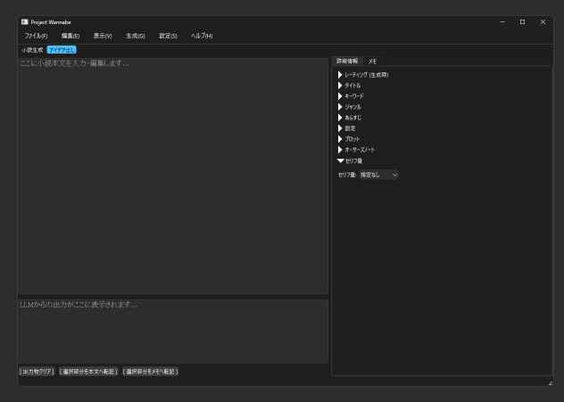
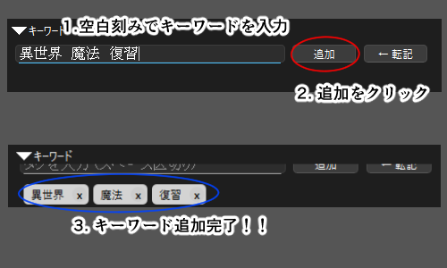
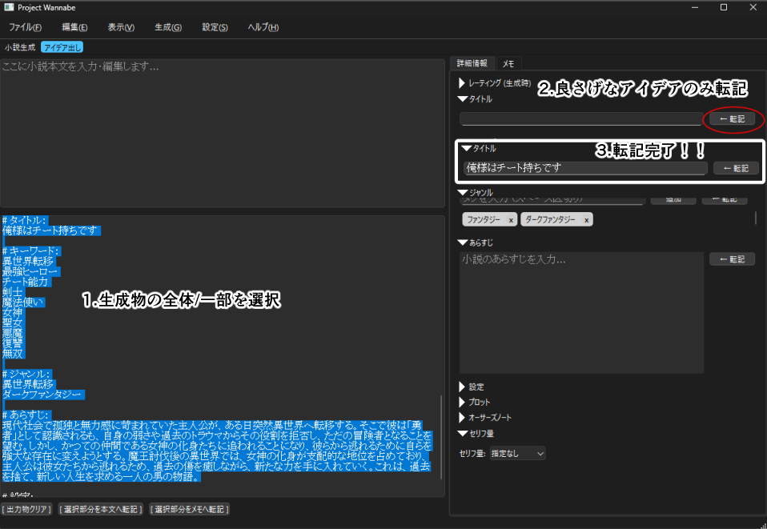
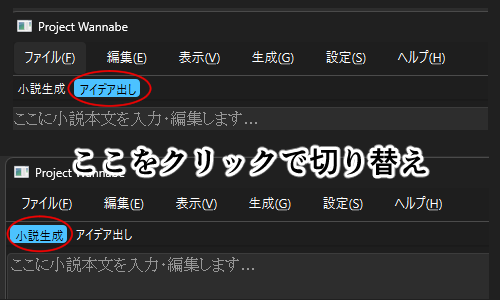

# Project Wannabe & KoboldCpp クイックアクセスガイド (Windows 向け)

## 1. はじめに

このガイドは、小説執筆支援アプリ `Project Wannabe` と、そのバックエンドとして動作する AI エンジン `KoboldCpp` を Windows 環境にセットアップし、連携させて動作確認件、作品作りまでの流れを説明します。

## 2. 前提条件

*   **Python のインストール:** Python 3.9 以上が必要です。インストールされていない場合は、[Python 公式サイト](https://www.python.org/) からダウンロードしてインストールしてください。（インストール時に「Add Python to PATH」にチェックを入れることを推奨します。）
*   **Git のインストール:** `Project Wannabe` のソースコードを取得するために Git が必要です。インストールされていない場合は、[Git for Windows](https://gitforwindows.org/) からダウンロードしてインストールしてください。

## 3. KoboldCpp のセットアップ

### (1) KoboldCpp 本体のダウンロード

1.  [KoboldCpp GitHub Releases](https://github.com/LostRuins/koboldcpp/releases/latest) にアクセスします。
2.  最新リリースの `Assets` セクションから `koboldcpp.exe` をダウンロードします。
3.  ダウンロードした `koboldcpp.exe` を、分かりやすい場所（例: `C:\KoboldCpp` など、**スペースを含まないパス**を推奨）に保存します。

### (2) AI モデルファイルのダウンロード

1.  `Project Wannabe` が推奨する `wanabi 24B` モデル（GGUF 形式）をダウンロードします。
    *   **[wanabi_24b_preview_gguf(現時点04/27の最新モデル、一部機能に非対応)](https://huggingface.co/kawaimasa/wanabi_24b_preview_gguf)]**
    *   *代替案:* もし上記モデルが入手できない場合や、他のモデルを試したい場合は、[Hugging Face](https://huggingface.co/) で "GGUF" と検索し、 `.gguf` 形式のファイルを探します。
2.  ダウンロードした `.gguf` ファイルを、`koboldcpp.exe` と同じフォルダ、または分かりやすい場所に保存します。

### (3) KoboldCpp の起動とモデルロード

1.  保存した `koboldcpp.exe` をダブルクリックして実行します。
2.  GUI が表示されたら、「Quick access」セクションの「Browse」ボタンをクリックし、手順 (2) でダウンロードした `.gguf` モデルファイルを選択します。
3.  **(推奨) GPU 設定:**
    *   **NVIDIA GPU の場合:**
        *   「Use CuBLAS」にチェックを入れます。
        *   「GPU Layers」の項目に、GPU にオフロードしたいレイヤー数を数字で入力します。(VRAM 容量に応じて調整してください。一般的に、数値が大きいほど高速になりますが、VRAM を超えるとエラーになります。VRAM 16GB 以上あれば `999` と入力して全レイヤーをオフロードできます。)
    *   **AMD/Intel GPU の場合:**
        *   「Use Vulkan」などのオプションを試してください。（環境によっては利用できない場合があります）
4.  **Context Size:** モデルが扱える文章の長さを設定します。使用するモデルや VRAM 容量に応じて調整してください。（例: `4096`, `8192` モデルの最大コンテキストは`32000`です。）
5.  **KV Cache:** 「Tokens」セクションにある「KV cache」を「8bit」に設定することを推奨します。(4bit が最軽量ですが、品質低下が大きいとされています。)
6.  設定が完了したら、「Launch」ボタンをクリックします。
7.  コンソールウィンドウが表示され、モデルのロードが始まります。しばらく待つと、コンソールに `KoboldAI API server listening at: http://localhost:5001` (または設定したポート番号) のようなメッセージが表示されれば起動成功です。
8.  **注意:** このコンソールウィンドウは KoboldCpp が動作している間、**閉じないでください。**

## 4. Project Wannabe のセットアップ

### (1) ソースコードのダウンロード (クローン)

1.  コマンドプロンプトまたは PowerShell を開きます。
2.  `Project Wannabe` を配置したいディレクトリに移動します (例: `cd F:\Project-Wannabe` の親ディレクトリ)。**スペースを含まないパス**を推奨します。
3.  以下のコマンドを実行して、ソースコードをダウンロードします。
    ```bash
    git clone https://github.com/kawaii-justice/Project-Wannabe.git
    ```


### (2) プロジェクトディレクトリへの移動

1.  コマンドプロンプトまたは PowerShell で、`Project Wannabe` のディレクトリに移動します。
    ```bash
    cd F:\Project-Wannabe
    ```

### (3) 仮想環境の作成と有効化

1.  以下のコマンドを実行して、Python 仮想環境を作成し、有効化します。
    ```bash
    python -m venv venv
    venv\Scripts\activate
    ```
2.  コマンドプロンプトの行頭に `(venv)` と表示されれば、仮想環境が有効になっています。

### (4) 依存ライブラリのインストール

1.  仮想環境が有効な状態で、以下のコマンドを実行して、必要なライブラリをインストールします。
    ```bash
    pip install -r requirements.txt
    ```

## 5. 連携と動作確認

### (1) KoboldCpp の起動確認

*   手順 3-(3) で起動した KoboldCpp のコンソールウィンドウが開いており、`listening at: http://localhost:5001` のようなメッセージが表示されていることを確認します。

### (2) Project Wannabe の起動

1.  `Project Wannabe` のディレクトリ (`F:\Project-Wannabe`) で、仮想環境が有効な状態 (行頭に `(venv)`) であることを確認します。
2.  以下のコマンドを実行して `Project Wannabe` を起動します。
    ```bash
    python main.py
    ```
  
このような画面が出れば起動成功です。

### (3) Project Wannabe の設定

1.  `Project Wannabe` のウィンドウが表示されたら、メニューバーの `設定` > `KoboldCpp 設定...` を開きます。
2.  「Port」が KoboldCpp の起動時に表示されたポート番号 (デフォルト: `5001`) と一致していることを確認し、必要であれば修正して「OK」をクリックします。

### (4) 簡単な動作確認

1.  `Project Wannabe` メニューバーの `生成` > `単発生成 (Ctrl+G)` をクリックします。
2.  左下の出力エリアに、AIが出力した文章が表示されれば連携成功です。


## 6. 初めての小説生成 - アイデア出しから完成まで

Project Wannabe を使って、AI の助けを借りながら小説を書き上げる基本的な流れを体験してみましょう。大まかな流れは以下のようになります。

1.  **アイデア出し:** AI に物語のプロットや設定のアイデアを出してもらう。
2.  **転記:** 生成されたアイデアを「詳細情報」タブに転記・編集する。
3.  **小説生成:** アイデアに基づいて、AI に小説の本文を生成してもらう。
4.  **本文へ転記:** 生成された本文を出力エリアからメインの本文エリアへ転記・編集する。
5.  **完成・保存・出力:** 物語が完成したら、プロジェクトを保存し、必要ならテキストファイルとして書き出す。

### (1) モード選択: アイデア出し

まずは物語の骨子となるアイデアを AI に考えてもらいます。

1.  ウィンドウ上部のツールバーで **「アイデア出し」** モードを選択します。このモードでは、入力された情報に基づいて物語の構成要素（タイトル案、キーワード、あらすじ、設定、プロット案など）を生成することに特化します。
    
2.  **(任意) 詳細情報の設定:** 右側の「詳細情報」タブを開き、生成したいアイデアの方向性を AI に伝えるために、いくつかの項目を入力します。タブ内の各セクションはクリックで開閉できます。
    *   **キーワード:** 思いつく単語をスペース区切りで入力し、「追加」ボタンを押します (例: `異世界`, `魔法`, `復讐`)。タグ形式で表示されます。
        
    *   **ジャンル:** 同様にジャンルを入力します (例: `ファンタジー`, `ダークファンタジー`)。
        
    *   **あらすじ:** 簡単なあらすじの希望があれば入力します。
    *   **設定:** 世界観やキャラクターの簡単な設定を入力します。
    *   **プロット:** 大まかな話の流れがあれば入力します。
    *   **タイトル:** 特定のタイトル案があれば入力します。
    *   **【注意事項】**
        *   **全ての項目を埋める必要はありません。** 空欄でもAIはアイデアを生成できるよう学習しています。入力が多いほど、より具体的なアイデアが出やすくなります。まずはキーワードやジャンルだけでも試してみましょう。
        *   **レーティング、オーサーズノート、セリフ量** の項目は、現バージョンではアイデア出し時のプロンプトには基本的に影響しません（これらは主に小説生成モードで、次期モデルでの対応が中心となります）。
3.  メニューバーの `生成` > `単発生成 (Ctrl+G)` をクリックします。
4.  左下の出力エリアに、AI が生成したアイデア（例: `# タイトル: ...`, `# キーワード: ...`, `# あらすじ: ...` のような形式）が表示されるのを待ちます。

### (2) アイデアの転記

生成されたアイデアの中から、気に入った部分を「詳細情報」タブに転記し、編集します。

1.  出力エリアで、転記したいアイデア（一部でも全体でも可）を選択します。
2.  転記したい項目に対応する「詳細情報」タブ内の **「← 転記」** ボタンをクリックします。
    *   例: タイトルを転記したい場合は、「タイトル」セクションの右側にある「← 転記」ボタンをクリックします。
    
3.  選択した内容が、対応する入力欄（タイトル、キーワード、あらすじなど）に自動で入力されます。キーワードやジャンルはタグ形式で反映され、あらすじなどはテキストエリアにコピーされます。
4.  必要な項目（タイトル、キーワード、あらすじ、設定、プロットなど）について、生成→転記作業を繰り返します。もちろん、自分で書いても構いませんし、転記後に各入力欄で自由に内容を編集、追記、削除することが可能です。(繰り返しますが**全てを埋める必要はありません。**)

### (3) モード選択: 小説生成

アイデアが固まったら、いよいよ小説本文の生成に移ります。

1.  ウィンドウ上部のツールバーで **「小説生成」** モードを選択します。このモードでは、「詳細情報」タブの内容と、左上の本文エリアの既存テキストを考慮して、物語の新規生成/続きを生成します。

    
2.  **(任意) オーサーズノートの入力:** 「詳細情報」タブの「オーサーズノート」セクションに、次に生成してほしいシーンの指示や雰囲気、登場人物の行動などを具体的に入力します。これは AI への直接的な指示として機能し、生成の方向性をコントロールするのに役立ちます。（この機能は本文が存在するときのみ有効です。本文の新規作成時はプロットの初めに最初のシーンの詳細を書くことである程度制御できます。）
    *   例:
    ```text
    主人公のエルフの少女が、森の中で迷子のドラゴンと出会うシーン。
    驚きと少しの警戒心、そして好奇心が入り混じった描写を。
    ```
    または単語の羅列も可能です。（改行区切り）
    ```text
    主人公エルフ
    迷子ドラゴン登場
    ```
    *   **【注意事項】** この項目もトレーニング中の次期モデルでの対応が主となりますが、現バージョンでもプロンプトの一部として利用されるため、記述することで生成結果に影響を与える可能性があります。詳細は後述しますが、作品全体の方向性を決めるプロットと異なり、次の1000文字程度の展開に影響します。
3.  **(任意) レーティングとセリフ量の設定:**
    *   「詳細情報」タブの「レーティング(生成時)」で、生成内容のレーティングを指定します（General/R-18）。
    *   「セリフ量」で、生成される文章中のセリフの多さを指定します（指定なし/少ない/普通/多いなど）。
    *   **【注意事項】** これらの項目も次期モデルでの対応が主となります。モデルによってはこれらの指定を解釈できない場合があります。

### (4) 本文の生成と転記

AI に小説の続きを書いてもらい、本文エリアに追記していきます。

1.  左上の本文エリア (`main_text_edit`) に、物語の書き出しや、続きを生成してほしい部分までの文章を入力します。最初は空でも構いません（その場合、詳細情報に基づいて冒頭から生成されます）。
2.  メニューバーの `生成` > `単発生成 (Ctrl+G)` をクリックします。
3.  左下の出力エリアに、AI が生成した続きの文章が表示されます。
4.  生成された内容を確認し、問題なければ出力エリアで生成されたテキスト全体（または必要な部分）を選択します。
5.  出力エリア下部にある **「[ 選択部分を本文へ転記 ]」** ボタンをクリックします。
6.  選択したテキストが、本文エリアの末尾（または設定に応じた位置）に追記されます。
    *   転記時の挿入位置や、転記前に入れる空行の数は、メニューの `設定` > `生成パラメータ設定...` > `出力から本文への転記設定` で変更できます。例えば、「常に次の行に挿入」を選び、「追加空行数」を1にすると、転記時に必ず改行＋1行空行が入るようになります。
7.  本文エリアの内容を編集したり、オーサーズノートを更新したりしながら、手順 2〜6 を繰り返し、物語を書き進めます。
    *   **無限生成 (F5):** 長い続きを自動で生成させたい場合は、`生成` > `無限生成 開始/停止 (F5)` を使用します。再度 F5 を押すまで、AI は自動で続きを生成し、出力エリアに追加し続けます（本文への転記は手動です）。無限生成中に詳細情報や本文を変更した場合、その変更が次の生成にすぐ反映されるかは、`設定` > `生成パラメータ設定...` > `無限生成中のプロンプト更新` で設定できます（即時反映/手動反映）。

### (5) 完成、保存、出力

物語が完成したら、作業内容を保存し、必要に応じてテキストファイルとして出力します。

1.  **プロジェクトの保存:**
    *   メニューバーの `ファイル` > `名前を付けて保存...` を選択します。
    *   ファイル名を入力し、「保存」をクリックします。現在の詳細情報タブの内容、本文エリアの内容、メモタブの内容が、まとめて1つの `.json` ファイルとして保存されます。このファイルがあれば、後で作業を再開できます。
    *   一度保存した後は、`ファイル` > `保存 (Ctrl+S)` （※もしメニューにあれば）で上書き保存できます。なければ再度「名前を付けて保存」を選びます。
2.  **本文の書き出し:**
    *   完成した小説本文を、他のエディタで開いたり、どこかに投稿したりするためにテキストファイルとして出力したい場合は、メニューバーの `ファイル` > `出力内容を書き出し...` を選択します。
    *   ダイアログが表示されるので、「ファイル冒頭に現在のタイトルを含める」かどうかを選択し、「Save」をクリックします。
    *   ファイル名を入力し、「保存」をクリックします。**現在、左上の本文エリアに入力されている内容** が `.txt` ファイルとして書き出されます。

これで、Project Wannabe を使った基本的な小説作成の流れは完了です。色々な設定やプロンプトを試して、あなただけの物語を創り上げてください！


### 付録: UI要素と設定項目の詳細説明

ここでは、Project Wannabe の主要なUI要素と設定項目について、もう少し詳しく説明します。

**A. 詳細情報タブの項目**

*   **レーティング (生成時):** 生成する内容の対象年齢を指定します (General/R-18)。モデルがこの指定を理解し、内容を調整するかどうかはモデルに依存します（次期モデル対応予定）。
*   **タイトル:** 作品のタイトルです。アイデア出しモードで生成されたものを転記したり、自分で入力したりします。
*   **キーワード:** 作品の重要な要素となる単語やフレーズをタグ形式で管理します。アイデア出しや小説生成時のプロンプトに含まれ、内容の方向性を与えます。スペース区切りで入力し「追加」でタグ化、タグ横の「x」で削除。
*   **ジャンル:** 作品のジャンルをタグ形式で管理します。キーワードと同様にプロンプトに含まれます。
*   **あらすじ:** 作品の概要です。アイデア出しで生成されたものを転記・編集したり、自分で入力したりします。小説生成時のプロンプトに含まれ、物語全体の流れを示唆します。
*   **設定:** 世界観、時代背景、登場人物の詳細な設定などを記述します。小説生成時のプロンプトに含まれ、描写の一貫性を保つのに役立ちます。
*   **プロット:** 物語の具体的な展開や構成案を記述します。小説生成時のプロンプトに含まれ、話の筋道を示します。
*   **オーサーズノート:** 次に生成してほしい内容への具体的な指示（シーン、登場人物、感情、行動など）を記述します。AIへの直接的な命令として機能します（次期モデル対応予定）。小説全体の方向性を制御するプロットとは異なり、オーサーズノートは本文直後の展開を指示します。
*   **セリフ量:** 生成される文章中のセリフの割合を指定します。モデルがこの指定をどの程度反映するかはモデル依存です（次期モデル対応予定）。

自由入力欄の項目は特定のフォーマットはありませんが、構造化は**推奨しません**。例えば箇条書きで書く場合、`- 〇〇`や`・〇〇`のように書くのではなく、改行区切りで記号を用いないことを推奨します。以下が例です。
```
主人公エルフ
迷子ドラゴン登場
```
またアイデア出し時に出てくるフォーマットは確実にサポートしています。
例えばplot欄
```
起:
承:
転:
結:
```
などです。
**B. 生成パラメータ設定 (メニュー > 設定 > 生成パラメータ設定...)**

*   **最大長 (アイデア出し / 小説生成):** 1回の生成で出力される最大のトークン（おおよそ文字数や単語数）を指定します。モードごとに設定できます。
*   **Temperature:** 値が高いほど、AIはより多様で創造的な（しかし時に突飛な）単語を選びやすくなります。低いほど、より決まりきった、予測可能な単語を選びやすくなります。通常 0.7〜1.0 程度が使われます。
*   **Min P:** 確率がこの値を下回るトークンは候補から除外されます。0.1 などに設定すると、非常に稀な単語の出現を抑制できます。通常は 0 のままが多いです。
*   **Top P (Nucleus Sampling):** 確率の高い単語から順に足していき、その合計確率がこの値を超えるまでの単語群の中から次の単語を選びます。例えば 0.9 なら、上位90%の確率を占める単語群から選びます。1.0 にすると全ての単語が候補になります。Temperature と並んで生成の多様性を制御する主要なパラメータです。通常 0.9〜0.95 程度。
*   **Top K:** 確率が上位 K 個の単語の中から次の単語を選びます。0 は無効を意味します。Top P と同時に指定した場合、両方の条件を満たす単語群から選ばれます。
*   **Repetition Penalty:** 同じ単語やフレーズが繰り返し出現するのを抑制するためのペナルティです。1.0 より大きい値を設定します。通常 1.1〜1.2 程度。上げすぎると不自然な文章になることがあります。
*   **デフォルトレーティング:** 新規プロジェクト開始時や設定リセット時の「レーティング(生成時)」の初期値を設定します。
*   **ストップシーケンス:** AIがこの文字列を生成したら、そこで生成を停止します。モデル特有の終了トークン（例: `<|endoftext|>`）や、特定の区切り文字（例: `---`）を指定するのに使います。1行に1つ記述します。
*   **継続タスクのプロンプト順序:** 小説生成モードで続きを生成する際、AIに与える情報（コンテキスト）の順序を選びます。「本文との整合性を優先」は、直前の文章との繋がりを重視する場合に、「詳細情報との整合性を優先」は、あらすじや設定など全体像との整合性をより重視する場合に有効かもしれません。または本文が長大かつ低コンテキスト長の場合、「詳細情報との整合性を優先」を選択することを推奨します。
*   **無限生成中のプロンプト更新:** 無限生成(F5)中に、本文エリアや詳細情報タブの内容を変更した場合、その変更を次の生成サイクルに「即時反映」させるか、一度生成を停止して再開するまで反映させない「手動」かを選びます。モードごとに設定可能です。
*   **出力から本文への転記設定:** 出力エリアから本文エリアへテキストを転記する際の挙動を設定します。「カーソル位置」「常に次の行」「行末の場合のみ次の行」から挿入方法を選び、「追加空行数」で改行後に挿入する空行数を指定できます。

**C. その他の設定・機能**

*   **KoboldCpp 設定 (メニュー > 設定 > KoboldCpp 設定...):** 接続する KoboldCpp のポート番号を設定します。KoboldCpp 側でポート番号を変更した場合に合わせます。
*   **テーマ切り替え (メニュー > 表示 > テーマ切り替え):** アプリの見た目をライトテーマとダークテーマで切り替えます。
*   **フォント設定 (メニュー > 表示 > フォント設定...):** アプリケーション内で使用するフォントの種類とサイズを変更します。
*   **メモタブ:** 右側のタブにある「メモ」エリアは、作品に関連するアイデアや参照情報などを自由に書き留めておくためのスペースです。プロジェクトファイル(.json)に保存されます。
*   **出力エリアのボタン:**
    *   `[ 出力物クリア ]`: 出力エリアの内容を全て消去します。
    *   `[ 選択部分を本文へ転記 ]`: 上記「(4) 本文の生成と転記」で説明した機能です。
    *   `[ 選択部分をメモへ転記 ]`: 出力エリアで選択したテキストを、右側の「メモ」タブの末尾に追記します。

